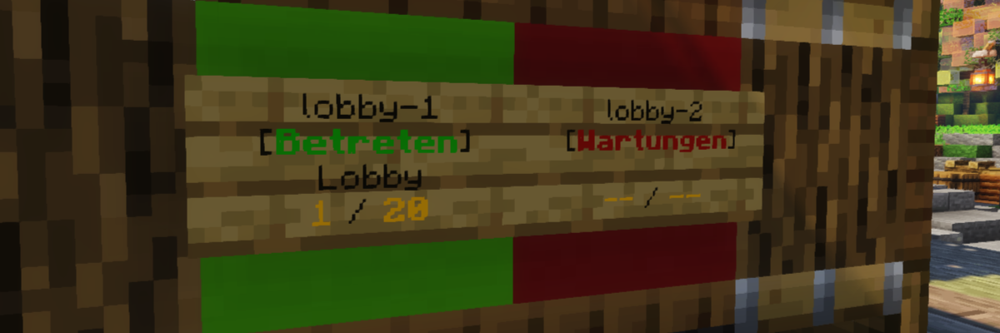

# Signs (Lobby-Server)
Dieses Plugin ist für die Lobby-Server (bzw. diejenigen Unterserver, auf denen es Schilder geben soll, mit denen man andere Server betreten kann) eines BungeeCord-Netzwerks entwickelt.
Es aktualisiert die Serverinformationen wie die Spieleranzahl und die MOTD auf den Schildern und ermöglicht es, den entsprechenden Server zu betreten.

Zur Verwendung dieses Plugins wird das [Signs-Plugin für Unterserver](https://github.com/Spigot-Plugin-Ecosystem/spigot-signs-subserver) benötigt, das dafür verantwortlich ist, die Serverinformationen in einer MySQL-Datenbank aktuell zu halten.

## Befehle
#### `/setsign [ serverName ]` (Berechtigung: `signs.setup`)
Synchronisiert das Schild, auf das der Spieler gerade schaut, mit dem Server mit dem angegebenen Namen.
`serverName` muss dabei der Name des Servers sein, unter dem er in der BungeeCord-Konfiguration definiert wurde.

## Setup

## Technische Details
#### Unterstützte Minecraft-Versionen
1.20 - 1.20.1

#### MySQL-Datenbank
Zur Verwendung dieses Plugins wird eine MySQL-Datenbank benötigt.

#### Signs-Plugin für Unterserver
Um dieses Plugin ohne Komplikationen verwenden zu können, muss das [Signs-Plugin für Unterserver](https://github.com/Spigot-Plugin-Ecosystem/spigot-signs-subserver) auf allen Unterservern installiert sein, für die ein Schild existieren soll.
