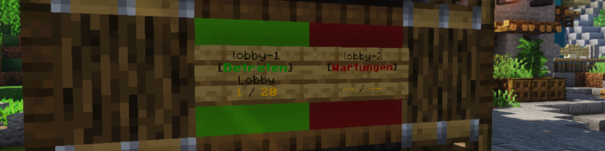

# Signs (Lobby-Server)
Dieses Plugin ist für die Lobby-Server (bzw. diejenigen Unterserver, auf denen es Schilder geben soll, mit denen man andere Server betreten kann) eines BungeeCord-Netzwerks entwickelt.
Es aktualisiert die Serverinformationen wie die Spieleranzahl und die MOTD auf den Schildern und ermöglicht es, den entsprechenden Server zu betreten.

Zur Verwendung dieses Plugins wird das [Signs-Plugin für Unterserver](https://github.com/Spigot-Plugin-Ecosystem/spigot-signs-subserver) benötigt, das dafür verantwortlich ist, die Serverinformationen in einer MySQL-Datenbank aktuell zu halten.

## Befehle
#### `/setsign [ serverName ]` (Berechtigung: `signs.setup`)
Synchronisiert das Schild, auf das der Spieler gerade schaut, mit dem Server mit dem angegebenen Namen.
`serverName` muss dabei der Name des Servers sein, unter dem er in der BungeeCord-Konfiguration definiert wurde.

## Setup
1. Installiere das Plugin auf einem Server, auf dem du Schilder erstellen möchtest.
   - Füge dazu die Plugin-JAR-Datei im `plugins`-Verzeichnis des Servers ein.
2. Starte den Server (neu), damit das Plugin geladen wird.
3. Bearbeite die Datei `config.yml` im Plugin-Verzeichnis und trage dort die Zugangsdaten zur MySQL-Datenbank ein (`host`, `port`, `database`, `username` und `password`). Beachte, dass die Zugangsdaten identisch mit denen des Signs-Plugins für Unterserver sein müssen.
4. Bearbeite die Datei `messages.yml`, im Plugin-Verzeichnis um die Nachrichten, die das Plugin sendet, anzupassen.
5. Setze ein Schild, indem du es platzierst, es ansiehst und den Befehl `/setsign [ serverName ]` ausführst.
   - `serverName` muss dabei der Name des Servers sein, unter dem er in der BungeeCord-Konfiguration definiert wurde.
   - Das Schild wird nun mit dem Server synchronisiert und zeigt die aktuelle Spieleranzahl und die MOTD an.
   - Ggf. musst du auf dem jeweiligen Unterserver zuerst noch das Signs-Plugin für Unterserver installieren.
6. Wiederhole Schritt 5 für alle Schilder, die du erstellen möchtest.
7. Kopiere das Plugin-Verzeichnis sowie die Plugin-JAR-Datei in das `plugins`-Verzeichnis aller Unterserver, die du ebenfalls mit Schildern ausstatten möchtest.
   - Beachte dabei, dass das die Schilder auf allen Unterservern mit dem gleichen Server synchronisiert werden, wenn an der entsprechenden Position auch ein Schild existiert.
   - Wenn das nicht erwünscht ist, darf die Datei `signs.yml` nicht mit kopiert werden.
8. Starte alle Unterserver, auf denen das Plugin installiert wurde (neu).

## Technische Details
#### Unterstützte Minecraft-Versionen
1.20 - 1.20.1

#### MySQL-Datenbank
Zur Verwendung dieses Plugins wird eine MySQL-Datenbank benötigt.

#### Signs-Plugin für Unterserver
Um dieses Plugin ohne Komplikationen verwenden zu können, muss das [Signs-Plugin für Unterserver](https://github.com/Spigot-Plugin-Ecosystem/spigot-signs-subserver) auf allen Unterservern installiert sein, für die ein Schild existieren soll.
